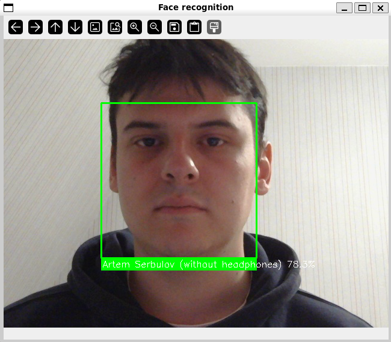
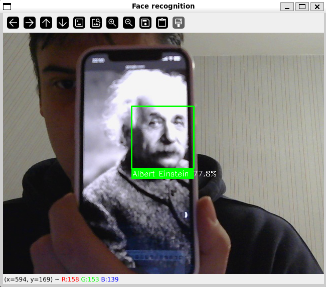

# Face Recognition Module

Below is the example of working face recognition library

# Training own model - Based on ResNet

Below is example of Artem Serbulov recognition

Below is example of Albert Einstein recognition

# Environment setup

Firstly, [camera_stream_server.py](camera_stream_server.py) file is need to be spinned up on **Windows**, because main scripts such as [face_rec.py](face_rec.py) and [face_rec_my_model.py](face_rec_my_model.py) do not have access to the webcam inside the **docker container**.  
Therefore, I need to open the webcam stream through the socket (0.0.0.0:8080) via [camera_stream_server.py](camera_stream_server.py) file and then connect to it through [face_rec.py](face_rec.py) or [face_rec_my_model.py](face_rec_my_model.py) file.  
Finally, [train.py](train.py) file is where training code exists.